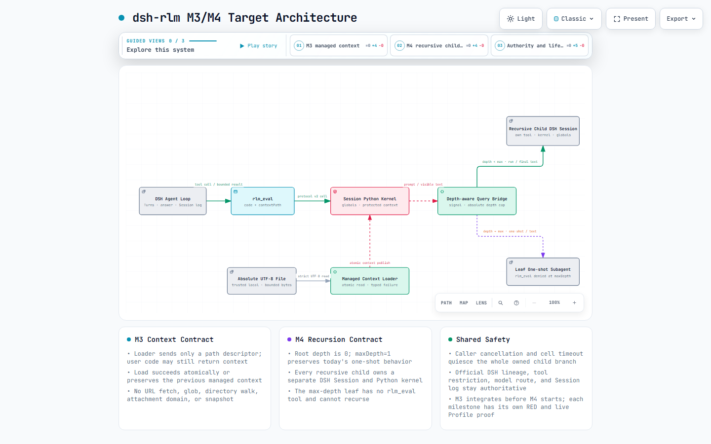

# dsh-rlm

`dsh-rlm` is a minimal Recursive Language Model (RLM) plugin for
[DeepSeek Harness](https://github.com/deepseek-ai/deepseek-harness). It gives a
DSH Agent one tool, `rlm_eval`, backed by a persistent Python namespace for the
current Session.

Python cells support top-level `await` and can call
`await rlm_query(prompt)`. The host answers that call through an official
one-shot DSH Subagent, returns visible text to Python, and lets the cell continue.

> Status: the end-to-end M1 loop is implemented and has passed a real clean
> Profile smoke test. M2 reliability is still open because the public audit
> found lifecycle and bounded-protocol defects. See [Project status](docs/project-status.md)
> and [Review findings](docs/review-findings.md).



The interactive diagram is available in
[docs/dsh-rlm-architecture.html](docs/dsh-rlm-architecture.html).

## Goal

The V1 goal is deliberately small:

```text
DSH Agent
  -> rlm_eval(code)
  -> current Session's persistent Python kernel
  -> await rlm_query(prompt)
  -> one-shot DSH Subagent (rlm_eval denied)
  -> visible text returns to Python
  -> cell continues
  -> a later rlm_eval reuses the same globals
```

The DSH Agent Loop and official Session log remain authoritative. Python never
becomes a second Agent Loop and does not receive DSH Provider or Session objects.

## Implemented

- one host-only function plugin and one model-facing tool: `rlm_eval`;
- one persistent Python process and globals namespace per DSH Session;
- top-level `await` and last-expression results;
- JSON-lines host/kernel protocol;
- `await rlm_query(prompt)` through a one-shot DSH Subagent;
- recursion prevention through `toolFilter: { deny: ['rlm_eval'] }`;
- typed syntax, runtime, protocol, timeout, cancellation, and process errors,
  with explicit query failure propagation;
- byte-bounded stdout and last-expression results;
- per-cell query count limit;
- timeout/cancellation eviction and clean namespace recreation;
- plugin teardown for owned Python kernels;
- offline tests plus a gated real clean-Profile smoke test.

## Not implemented

These are intentionally outside V1 unless a real use case triggers them:

- snapshot/restore or cross-host persistence;
- recursive child RLMs;
- continuable/background spawn;
- batched queries;
- a public `RlmService` or Kernel Provider framework;
- a Storage Domain, Workflow, Jobs, Team, or UI;
- container or remote kernels.

Open reliability defects and conditional future work are separated in
[Project status](docs/project-status.md). GitHub Issues are the live work authority.

## Security model

The current Python kernel is **trusted local execution, not a sandbox**.
`rlm_eval` can read and modify files and start processes with the DSH host user's
permissions. Do not enable it for untrusted users, prompts, or workspaces.

The public audit also confirmed that the child Python process currently inherits
the host environment. Until that issue is fixed, do not start DSH with secrets in
ambient environment variables when this plugin is enabled. See [SECURITY.md](SECURITY.md).

## Requirements

- Node.js `^22.19.0` or `>=24`;
- pnpm `9.15.9`;
- Python 3.11+ available as `python` on `PATH`;
- a compatible DeepSeek Harness checkout/Profile with the peer dependencies in
  [package.json](package.json);
- a configured DSH one-shot Subagent provider (the default is `spawn`).

## Local development

```bash
pnpm install --frozen-lockfile
pnpm typecheck
pnpm build
node --test tests/rlm-loop.test.ts tests/profile-smoke.test.ts
```

The two real Profile tests are intentionally gated because they install a fresh
Profile and call a configured model. The current test harness expects this
repository at `packages/.external/dsh-rlm` inside a DeepSeek Harness checkout;
it is not an independent-clone smoke runner:

```bash
RLM_LIVE_SMOKE=1 DSH_HOME=/path/to/configured/dsh-home \
  node --test tests/profile-smoke.test.ts
```

Never point the live smoke at an unverified or user-owned target. It creates and
removes an isolated temporary DSH home, but it copies the complete `settings.yaml`
and, when present, the complete `.credentials.yaml` from the supplied `DSH_HOME`.
Those temporary files and Session logs must never be committed or uploaded.

## Install into a DSH Profile

Build this checkout, then run the following from the root of a compatible
DeepSeek Harness checkout (where its `pnpm dsh` command is available):

```bash
pnpm dsh plugin --profile <profile> add -w /absolute/path/to/dsh-rlm
```

Enable it in the Profile's Cordis composition:

```yaml
- insert:
    - id: rlm
      name: dsh-rlm
      config:
        enabled: true
        provider: spawn
```

This repository has not published an npm package. The command above is a real
local-package Profile installation, not a registry installation.

## Example

The Agent can call `rlm_eval` with a cell such as:

```python
context = open(path, encoding="utf-8").read()
draft = await rlm_query("Summarize the key evidence in this context:\n" + context)
draft
```

A later cell in the same DSH Session can reuse `context` and `draft`:

```python
revision = await rlm_query("Critique and improve this draft:\n" + draft)
revision
```

## Documentation

- [Architecture](docs/architecture.md)
- [Interactive architecture diagram](docs/dsh-rlm-architecture.html)
- [Directory and language boundaries](docs/directory-structure.md)
- [Milestone definitions](docs/milestones.md)
- [Project status: completed and incomplete work](docs/project-status.md)
- [Reference analysis](docs/reference-analysis.md)
- [Independent review reconciliation](docs/review-findings.md)
- [Future extensions and their triggers](docs/future-extensions.md)
- [Contributing](CONTRIBUTING.md)
- [Security](SECURITY.md)

## References

The repository contains pinned source identities—not vendored upstream source—for:

- `PrimeIntellect-ai/prime-agent@6179a608f394d0858d463e40d648df0def6dbb7a`;
- `alexzhang13/rlm@854e688fbba9d8f8989e3da9989812e4b6dfe270`.

See [ref/README.md](ref/README.md). The ignored `ref/*/source/` checkouts are local,
read-only review evidence and are not published in this repository.

## License

[MIT](LICENSE). This package originated inside the MIT-licensed DeepSeek Harness
checkout, so its upstream copyright notice is preserved; see [NOTICE](NOTICE).
